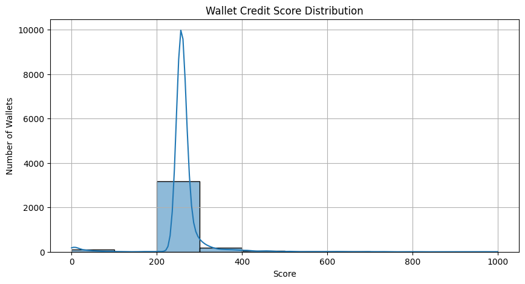

# Credit Score Analysis Report

This report analyzes how Ethereum wallets performed on the Aave V2 protocol, based on their credit scores (ranging from 0 to 1000). These scores were calculated from historical transaction behavior using metrics like deposits, borrows, repayments, and liquidations.

---

## Score Distribution

*Histogram of all wallet credit scores. Binned into 10 equal-width buckets (0–100, 100–200, ..., 900–1000).*

---

## Score Range Buckets

| Score Range | Interpretation                  |
|-------------|----------------------------------|
| 0–200       | Highly risky, likely liquidated |
| 200–400     | Below average, weak repayment   |
| 400–600     | Moderate usage, mixed behavior  |
| 600–800     | Responsible borrowers           |
| 800–1000    | Excellent credit behavior       |

---

## Top 5 Wallets by Score

| Wallet | Txns | Deposits | Borrows | Repays | Liquidations | Credit Score |
|--------|------|----------|---------|--------|--------------|---------------|
| `0x04d9...7e5` | 1089 | 411 | 178 | 291 | 0 | 1000 |
| `0x0034...e62` | 162 | 59 | 45 | 21 | 0 | 964 |
| `0x000f...790` | 73 | 26 | 19 | 13 | 0 | 801 |
| `0x047a...5df` | 820 | 179 | 200 | 207 | 0 | 733 |
| `0x00aa...5c0` | 633 | 289 | 89 | 176 | 0 | 725 |

### High Score Behavior Patterns
- Large number of transactions
- Frequent deposits and full/partial repayments
- **Zero liquidations**
- Strong and consistent usage across actions

---

## Bottom 5 Wallets by Score

| Wallet | Txns | Deposits | Borrows | Repays | Liquidations | Credit Score |
|--------|------|----------|---------|--------|--------------|---------------|
| `0x0608...84e` | 4 | 1 | 1 | 0 | 2 | 0 |
| `0x03f9...6ae` | 3 | 1 | 1 | 0 | 1 | 0 |
| `0x003b...84f` | 4 | 0 | 1 | 0 | 3 | 0 |
| `0x052a...fc1` | 3 | 1 | 1 | 0 | 1 | 0 |
| `0x009b...6f3` | 3 | 1 | 1 | 0 | 1 | 0 |

### Low Score Behavior Patterns
- Very few transactions
- **No repayments at all**
- 1–3 liquidations
- Likely abandoned or exploit-style wallets

---

## Key Takeaways

- **Liquidation** is a strong negative factor. Almost every wallet with a score of 0 has been liquidated.
- **Repayments** improve score significantly — even more than deposits.
- **Frequent, diverse interaction** with Aave (deposit → borrow → repay cycle) signals responsible behavior.
- One-off usage or borrowing without repaying triggers risk flags.

---

## Conclusion

The scoring system effectively separates responsible users from risky ones based on wallet behavior alone — with no KYC, and just on-chain data. This approach can be generalized for other DeFi protocols or future lending models in Web3.

---

**Author:** Vivek Tomar  
**Date:** July 2025
